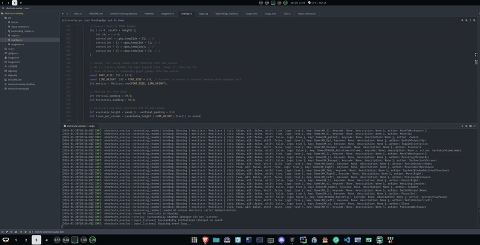

<div align="center">
  
</div>

<div align="center">
  <h1 text-align="center"> A shortcuts overlay for the COSMIC™ DE.</h1>
    
  

</div>


A keyboard shortcuts overlay for the COSMIC™ DE in a semi-transparent overlay surface. 
- [X] The overlay is *only* displayed  as long as a specific predefined hotkey is pressed, similar to how
   it works on Android for various tablets.
- [X] The overlay is only displayed only on the output/display that has focus and changes accordingly.
- [X] Intended usage is to be run as a background service with no disruption.


## Other projects:
 - **ElementaryOs** app:  https://github.com/elementary/shortcut-overlay
 - **Ubuntu Unity's** overlay:  [Unity's desktop overlay](https://bugs.launchpad.net/ayatana-design/)
 - iPadOS/Android tablet: [iPadOS](https://www.reddit.com/r/iPadOS/comments/nkp6j6/overlaid_overlay_why_does_ios_cover_up_app/)

## Features

- **Wayland Native**: Built using smithay-client-toolkit for native Wayland support
- **Layer Shell**: Uses wlr-layer-shell protocol for overlay functionality
- **Singleton Instance**: Ensures only one instance runs at a time using file locking
- **Semi-transparent UI**: Displays shortcuts with a blurred background effect
- **Key Detection**: Uses libinput to globally detect  key press/release events

The overlay automatically detects and reads keyboard shortcuts from:

- **COSMIC™**: `~/.config/cosmic/config`
- Other: WIP

## Requirements

- Rust 1.70 or later
- libwayland-dev
- libxkbcommon-dev
- Access to `/dev/input/event*` devices (user must be in the `input` group or run with appropriate permissions, see [#permissions-setup](#permissions-setup))

## Installation

### From Source

```bash
# Install system dependencies (Ubuntu/Debian)
sudo apt-get install libwayland-dev libxkbcommon-dev

# Clone and build
git clone https://github.com/l-const/shortcuts-overlay.git
cd shortcuts-overlay
cargo build --release
```

### Permissions Setup

> [!WARNING]  
> The application uses libinput to read input events and detect key presses. This requires permission to access input devices.


#### Manual Setup

Add your user to the `input` group manually:

```bash
sudo usermod -a -G input $USER
```

**After either method, you MUST log out and log back in for the changes to take effect.**

Verify the setup worked:
```bash
groups
# You should see 'input' in the list
```

### Usage


- Run the application:
```bash
./target/release/shortcuts-overlay
```

The overlay will automatically appear when you press and hold the **Ctrl** key (left or right), and disappear when you release it. The application uses libinput for global keyboard monitoring.

- CLI options
  - `--width <PX>`  — overlay client width in pixels (default: 1200)
  - `--height <PX>` — overlay client height in pixels (default: 800)
  - `--anchor <POSITION>` — overlay anchor position (default: center)
    - Available values: `center`, `topleft`, `topright`, `bottomleft`, `bottomright`, `top`, `bottom`, `left`, `right`

- Environment variables (alternative to CLI)
  - `SHORTCUTS_OVERLAY_WIDTH` — overlay client width in pixels
  - `SHORTCUTS_OVERLAY_HEIGHT` — overlay client height in pixels

### Installing Desktop Entry & Icon

To make the application appear in your application launcher with an icon:

```bash
# Install desktop entry and icon
make install-desktop

# This will:
# - Install logo.svg to ~/.local/share/icons/hicolor/scalable/apps/shortcuts-overlay.svg
# - Install shortcut-overlay.desktop to ~/.local/share/applications/
# - Update icon and desktop databases
```

To uninstall:
```bash
make uninstall-desktop
```

- Examples:
```bash
# Run with explicit size via CLI
./target/release/shortcuts-overlay --width 1200 --height 800

# Run with custom anchor position
./target/release/shortcuts-overlay --anchor topright

# Run with size and anchor
./target/release/shortcuts-overlay --width 1200 --height 800 --anchor bottomleft

# Run with env vars
SHORTCUTS_OVERLAY_WIDTH=900 SHORTCUTS_OVERLAY_HEIGHT=500 ./target/release/shortcuts-overlay
```

### How It Works

- **Press key**: The overlay layer surface is created and displayed with your keyboard shortcuts
- **Release key**: The overlay layer surface is destroyed and hidden
- The application uses libinput (via the `input` crate) to monitor keyboard input globally, allowing it to detect key events even when the overlay doesn't have focus
- Libinput is the same input library used by Wayland compositors, providing stable and efficient event handling
- The overlay displays keyboard shortcuts found in your compositor's config file

### Example Output

The overlay displays shortcuts like:
```
Super + Return: Launch terminal
Super + d: Launch application launcher  
Super + Shift + q: Close window
Super + f: Toggle fullscreen
Alt + Tab: Cycle windows
```

However, this is not recommended for security reasons. It's better to properly configure group membership.

### Checking Device Access

To verify you have access to input devices:
```bash
ls -l /dev/input/event* | head -5
# Should show files readable by the 'input' group

groups
# Should include 'input'
```
